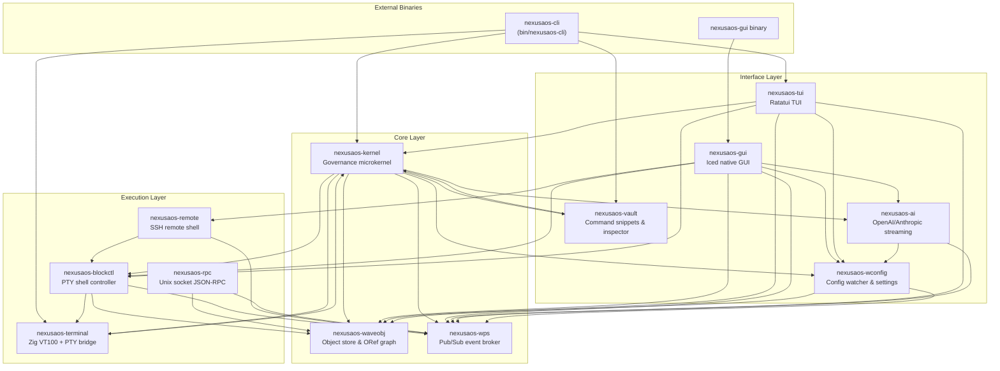
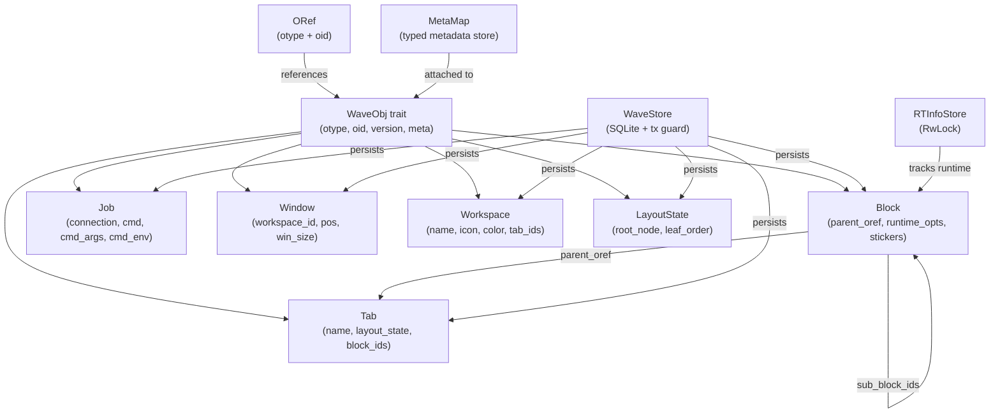
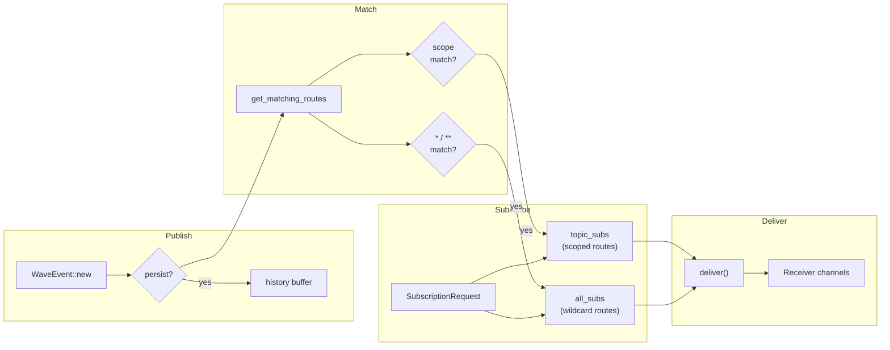
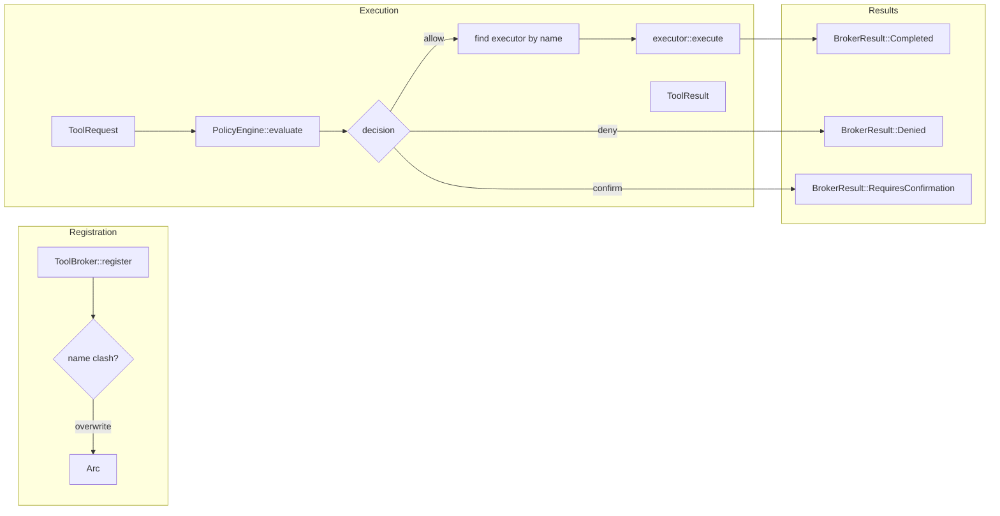
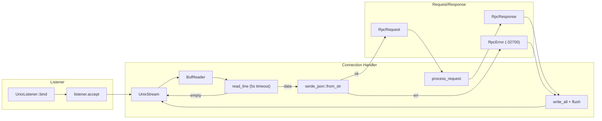
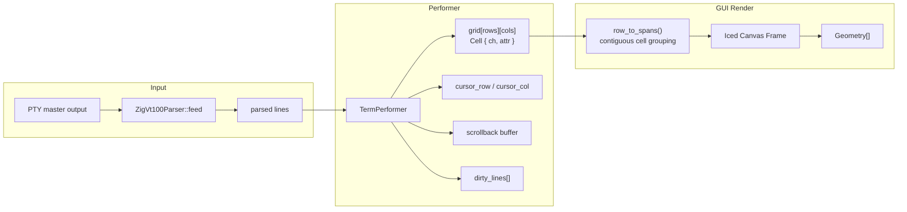
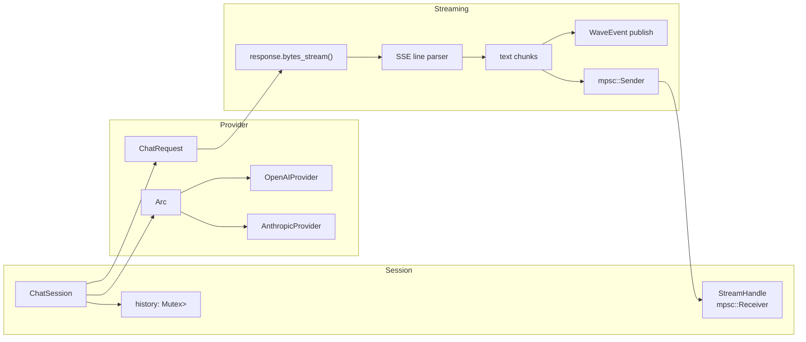
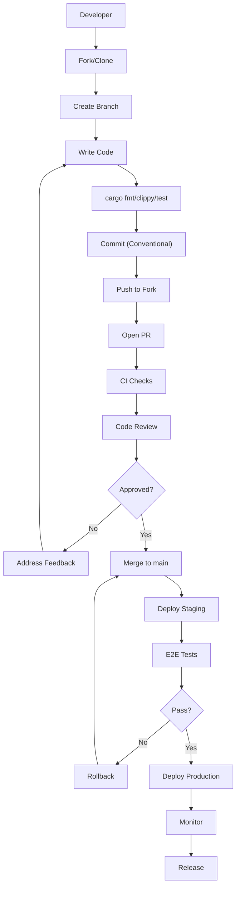

# NexusAOS Architecture — Dependency Graph & System Mind Map

> VS Code Markdown Preview renders the Mermaid diagrams below.
> Install “Markdown Preview Mermaid” if preview is disabled.

---

## 1. Workspace Crate Dependency Graph



---

## 2. Kernel Runtime — Data Flow

```mermaid
graph LR
    subgraph "Entry"
        submit["Kernel::submit_task"]
    end

    subgraph "Policy"
        policy["PolicyEngine::evaluate"]
        dedup["Task deduplication<br/>(dedup_window_secs)"]
    end

    subgraph "Router"
        router["TaskRouter::route"]
        decision["RouteDecision<br/>primary_role / secondary_roles"]
    end

    subgraph "Planner"
        planner["PlannerProvider::complete"]
        plan_resp["CompletionResponse"]
    end

    subgraph "Coder"
        coder["CoderProvider::complete"]
        code_resp["CompletionResponse"]
    end

    subgraph "Reviewer"
        reviewer["ReviewerProvider::complete"]
        review_resp["CompletionResponse"]
    end

    subgraph "Tools"
        broker["ToolBroker::execute"]
        executor["ToolExecutor impls"]
        result["ToolResult"]
    end

    subgraph "State"
        projection["TaskProjection<br/>(RwLock<HashMap>)"]
        event_store["EventStore<br/>(append-only)"]
        snapshot["SnapshotStore<br/>(compaction)"]
    end

    subgraph "Shutdown"
        shutdown["ShutdownHandler"]
    end

    submit --> dedup
    dedup --> policy
    policy --> router
    router --> decision
    decision --> planner
    planner --> plan_resp
    plan_resp --> coder
    coder --> code_resp
    code_resp --> reviewer
    reviewer --> review_resp
    review_resp --> broker
    broker --> executor
    executor --> result
    result --> projection
    projection --> event_store
    event_store --> snapshot
    snapshot --> shutdown
```



---

## 3. Wave Object Model — Type Hierarchy



---

## 4. WPS Pub/Sub — Event Flow



---

## 5. Tool Broker — Execution Path



---

## 6. RPC Server — Frame Protocol



---

## 7. Terminal Rendering Pipeline



---

## 8. AI Provider — Streaming Path



---

## 9. Module → Public Function Inventory

### nexusaos-kernel (`crates/nexusaos-kernel/src/`)

| Module | Key Public Types / Functions |
|--------|------------------------------|
| `capability` | `Scope`, `Capability`, `CapabilityLease`, `CapabilitySet` |
| `config` | `AppConfig`, `GeneralConfig`, `ResourceLimitsConfig`, `PolicyConfig`, `ContextConfig`, `ModelProviderConfig`, `ToolsConfig`, `load()` |
| `context` | `ContextBudget::estimate()` |
| `error` | `NexusError`, `ConfigError`, `StorageError`, `PolicyError`, `ProviderError`, `ToolError`, `TaskError`, `ResourceError` |
| `events` | `EventId`, `SequenceNumber`, `EventKind`, `EventPayload`, `EventMetadata`, `Event::new()` |
| `model::registry` | `ProviderRegistry::new/register/get/available_roles/health_check_all` |
| `model::openai_compat` | `OpenAIProvider::new`, `stream_chat()` |
| `model::claude` | `ClaudeProvider::new`, `stream_chat()` |
| `model::types` | `ModelRole`, `CompletionRequest`, `CompletionResponse`, `ChatRole`, `ChatMessage` |
| `policy` | `PolicyEngine::new/evaluate` |
| `resource` | `ResourceMonitor::snapshot` |
| `router` | `TaskRouter::route`, `RouteDecision` |
| `runtime::kernel` | `Kernel::new/submit_task/execute_task/transition_task/task_count` |
| `runtime::replay` | `ReplayEngine::replay` |
| `runtime::scheduler` | `TaskScheduler::new/submit/run` |
| `runtime::shutdown` | `ShutdownHandler::new/shutdown` |
| `state` | `TaskState` (state machine + transitions) |
| `storage::event_store` | `EventStore::open/append/read_all` |
| `storage::snapshot` | `SnapshotStore::new/save/load_latest/list/compact` |
| `storage::projection` | `TaskProjection::new/apply_event` |
| `task` | `TaskId`, `TaskInput`, `TaskRequest`, `TaskRecord`, `TaskOutcome` |
| `tools::broker` | `ToolBroker::new/register/execute/available_tools`, `BrokerResult` |
| `tools::executor` | `ToolRequest`, `ToolResult`, `ToolExecutor` trait |
| `tools::filesystem` | `FilesystemTool::new` |
| `tools::git` | `GitTool::new` |
| `tools::terminal` | `TerminalTool::new` |

### nexusaos-waveobj (`crates/nexusaos-waveobj/src/`)

| Module | Key Public Types / Functions |
|--------|------------------------------|
| `oref` | `ORef::new/parse/to_string`, `ORefError` |
| `meta` | `MetaMap::new/set/get_string/get_int/get_float/get_bool/get_string_list/get_string_map/merge` |
| `types` | `Block`, `Job`, `Window`, `Workspace`, `Tab`, `LayoutState`, `Client`, `StickerType`, `RuntimeOpts` — all implement `WaveObj` |
| `store` | `WaveStore::open/open_in_memory/with_tx/insert/get/get_all/find_workspace_for_tab` |
| `rtinfo` | `ObjRTInfo`, `RTInfoStore::new/get/set/remove` |

### nexusaos-wps (`crates/nexusaos-wps/src/`)

| Module | Key Public Types / Functions |
|--------|------------------------------|
| `events` | `WaveEvent::new/global/with_persist`, `FileEventData`, `SubscriptionRequest` |
| `broker` | `Broker::new/subscribe/unsubscribe/unsubscribe_all/publish/read_history/subscriber_count/get_matching_routes/receiver` |

### nexusaos-blockctl (`crates/nexusaos-blockctl/src/`)

| Module | Key Public Types / Functions |
|--------|------------------------------|
| `controller` | `Controller` trait, `ControllerStatus`, `BlockInput`, `ControllerError`, `ControllerRegistry` |
| `shell` | `ShellController::new/start/stop/send_input/runtime_status/conn_name` |
| `filestore` | `BlockFileStore::new/append/read_all/read_tail/truncate/delete_zone/zone_size/set_max_size` |

### nexusaos-rpc (`crates/nexusaos-rpc/src/`)

| Module | Key Public Types / Functions |
|--------|------------------------------|
| `message` | `RpcRequest`, `RpcResponse`, `RpcError` |
| `handler` | `RpcHandler::new/process_request/handle_connection` |
| `server` | `RpcServer::new/run` |

### nexusaos-remote (`crates/nexusaos-remote/src/`)

| Module | Key Public Types / Functions |
|--------|------------------------------|
| `ssh_client` | `ClientHandler` (implements `russh::client::Handler`) |
| `connection` | `ConnectionManager::new/connect/disconnect` |
| `remote_shell` | `RemoteShellController::new/start/stop/send_input/runtime_status/conn_name` |
| `monitor` | `ConnectionMonitor::new` |

### nexusaos-terminal (`crates/nexusaos-terminal/src/`)

| Module | Key Public Types / Functions |
|--------|------------------------------|
| `ffi` | `ZigVt100Parser::new/feed/lines_processed/bytes_processed` |
| `pty` | `PtyManager::spawn/read_output/write_input/spawn_reader_task/shutdown` |

### nexusaos-vault (`crates/nexusaos-vault/src/`)

| Module | Key Public Types / Functions |
|--------|------------------------------|
| `inspector` | `FlagInspector::explain_flags` |
| `resolver` | `ParameterResolver::extract_placeholders/resolve` |
| `snippet` | `CommandSnippet::new`, `VaultStore::new/save/load_all` |

### nexusaos-tui (`crates/nexusaos-tui/src/`)

| Module | Key Public Types / Functions |
|--------|------------------------------|
| `block` | `BlockKind`, `TileBlock::new`, `TileGrid::new/split_tile/close_active/toggle_maximize/cycle_focus` |
| `diff` | `DiffViewer::render_diff` |
| `stream` | `TokenStreamer::push_token` |
| `modal` | `ApprovalModal::confirm_prompt` |
| `patch` | `PatchEngine::apply_patch` |

### nexusaos-gui (`crates/nexusaos-gui/src/`)

| Module | Key Public Types / Functions |
|--------|------------------------------|
| `terminal` | `TerminalState::new/default/write_to_pty/handle_char/handle_key/title`, `TermPerformer`, `Cell`, `CellAttr`, `TermColor`, `Parser` |
| `view` | `TerminalView` (iced `Program` impl) |
| `app` | `NexusApp`, `Message`, `Tab`, `ChatMessage` |

### nexusaos-ai (`crates/nexusaos-ai/src/`)

| Module | Key Public Types / Functions |
|--------|------------------------------|
| `provider` | `ModelProvider` trait, `ChatMessage`, `ChatRequest`, `AiError` |
| `openai` | `OpenAIProvider::new`, `stream_chat()` |
| `anthropic` | `AnthropicProvider::new`, `stream_chat()` |
| `session` | `ChatSession::new/send_message/send_message_stream`, `StreamHandle::new/try_recv` |

### nexusaos-wconfig (`crates/nexusaos-wconfig/src/`)

| Module | Key Public Types / Functions |
|--------|------------------------------|
| `settings` | `GlobalSettings`, `load()` |
| `watcher` | `ConfigWatcher::new/watch` |

---

## 10. External Dependency Map

```mermaid
graph TD
    subgraph "Async Runtime"
        tokio["tokio 1.x<br/>(full, rt-multi-thread)"]
        futures["futures 0.3"]
        async_trait["async-trait 0.1"]
    end

    subgraph "Serialization"
        serde["serde 1.x"]
        serde_json["serde_json 1.x"]
        toml["toml 0.8"]
    end

    subgraph "Error / CLI"
        thiserror["thiserror 2.x"]
        anyhow["anyhow 1.x"]
        clap["clap 4.x"]
    end

    subgraph "Observability"
        tracing["tracing 0.1"]
        tracing_sub["tracing-subscriber 0.3"]
    end

    subgraph "AI / Network"
        reqwest["reqwest 0.12<br/>(json, stream)"]
        russh["russh 0.43"]
        russh_keys["russh-keys 0.43"]
    end

    subgraph "Persistence"
        rusqlite["rusqlite 0.32<br/>(bundled, backup)"]
        uuid["uuid 1.x<br/>(v4, v7, serde)"]
        chrono["chrono 0.4<br/>(serde)"]
    end

    subgraph "Terminal / GUI"
        portable_pty["portable-pty 0.8"]
        vte["vte 0.13"]
        iced["iced 0.14<br/>(tokio, canvas)"]
        ratatui["ratatui 0.29"]
        crossterm["crossterm 0.28<br/>(event-stream)"]
        notify["notify 6.1"]
    end

    subgraph "System"
        sysinfo["sysinfo 0.32"]
        regex["regex 1.x"]
    end

    KERNEL --> tokio
    KERNEL --> serde
    KERNEL --> thiserror
    KERNEL --> reqwest
    KERNEL --> tracing
    KERNEL --> rusqlite
    KERNEL --> uuid
    KERNEL --> chrono
    KERNEL --> sysinfo

    WAVEOBJ --> serde
    WAVEOBJ --> uuid
    WAVEOBJ --> chrono
    WAVEOBJ --> rusqlite

    WPS --> tokio
    WPS --> serde
    WPS --> uuid
    WPS --> chrono

    BLOCKCTL --> portable_pty
    BLOCKCTL --> tokio

    TERMINAL --> portable_pty
    TERMINAL --> KERNEL

    GUI --> iced
    GUI --> vte
    GUI --> portable_pty

    TUI --> ratatui
    TUI --> crossterm

    REMOTE --> russh
    REMOTE --> russh_keys

    RPC --> tokio

    AI --> reqwest
    AI --> futures

    VAULT --> regex
    VAULT --> KERNEL

    WCONFIG --> notify
```



---

## 11. Function-Level Cross-Reference Map

### Kernel submit_task → execute_task Flow

```
Kernel::submit_task
  ├── dedup check (TaskInput equality within dedup_window_secs)
  ├── PolicyEngine::evaluate("task.create")
  ├── EventStore::append(TaskCreated)
  ├── TaskRouter::route
  │     └── normalize_confidence / keyword matching
  ├── EventStore::append(TaskClassified)
  └── returns TaskId

Kernel::execute_task
  ├── ProviderRegistry::get(ModelRole::Planner)
  ├── ModelProvider::complete (Planner)
  ├── EventStore::append(ModelResponded)
  ├── TaskRouter::route again
  ├── ProviderRegistry::get(ModelRole::Coder)
  ├── ModelProvider::complete (Coder)
  ├── ProviderRegistry::get(ModelRole::Reviewer)
  ├── ModelProvider::complete (Reviewer)
  ├── ToolBroker::execute
  │     ├── PolicyEngine::evaluate
  │     └── ToolExecutor::execute
  ├── EventStore::append(ToolResult)
  ├── TaskState transition: Planned → Executing → Completed/Failed
  └── returns TaskOutcome
```

### WaveObj Persistence Flow

```
WaveStore::insert
  ├── with_tx (SQLite transaction guard)
  ├── INSERT db_block
  ├── EventStore::append(ObjectCreated)
  └── commit / rollback

WaveStore::get
  ├── SELECT FROM db_block WHERE oid = ?
  ├── deserialize JSON -> T
  └── rebuild ORef

RTInfoStore::set
  ├── RwLock write guard
  └── HashMap::insert

RTInfoStore::get
  ├── RwLock read guard
  └── HashMap::get + cloned
```

### Terminal Rendering Flow

```
TerminalState::write_to_pty
  └── Option<Mutex<Box<dyn Write>>>::write_all + flush

TerminalState::handle_key
  ├── Ctrl+letter → ASCII control code
  ├── Alt+key → ESC prefix
  ├── Named F-keys → CSI sequences
  └── write_to_pty

TermPerformer::advance (via vte::Parser)
  ├── grid[row][col].ch = character
  ├── CellAttr updates (fg, bg, bold, italic, underline, reverse)
  ├── cursor movement
  ├── scroll / scrollback
  └── dirty_lines marking
```

---

## 12. Unused / Dead Code Resolution Log

| File | Issue | Resolution |
|------|-------|------------|
| `src/model/registry.rs` | `unimplemented!()` stub, never compiled | Delete entire `src/` tree (orphaned) |
| `src/runtime/kernel.rs` | Duplicate of active crate file | Delete entire `src/` tree |
| `crates/nexusaos-waveobj/src/store.rs` | `format!` with no interpolation | Replaced with string literal |
| `crates/nexusaos-terminal/src/pty.rs` | `PTY_MAX_BUFFER` unused | Used in backpressure range check |
| `crates/nexusaos-gui/src/app.rs` | Collapsible `if let` chains | Collapsed with `&& let` |
| `crates/nexusaos-gui/src/view.rs` | Useless `.into()` conversion | Removed redundant cast |
| `crates/nexusaos-remote/src/remote_shell.rs` | Empty test functions | Added `ControllerStatus` and `BlockInput` assertions |
| `crates/nexusaos-remote/src/ssh_client.rs` | Empty + fragile tests | Added meaningful assertions |
| `crates/nexusaos-terminal/src/ffi.rs` | Tautological `>= 0` on `usize` | Replaced with real byte-count assertion |

---

## 13. Benchmark Inventory

| Benchmark | What it measures | Location |
|-----------|------------------|----------|
| `bench_terminal_parsing` | VT100 parser throughput: 1KB text, ANSI colors, cursor movement, scrolling | `tests/benchmarks/performance.rs` |
| `bench_kernel_task_submission` | `Kernel::submit_task` latency | `tests/benchmarks/performance.rs` |
| `bench_event_store` | Event append + read_all throughput | `tests/benchmarks/performance.rs` |
| `bench_terminal_rendering` | Span-batching render simulation over 30×120 grid | `tests/benchmarks/performance.rs` |
| `bench_snapshot_projection` | ReplayEngine over 100 events | `tests/benchmarks/performance.rs` |
| `bench_tool_broker_throughput` | ToolBroker register + available_tools | `tests/benchmarks/performance.rs` |

---

## 14. Test Coverage Map

| Crate | Test Count | Coverage Notes |
|-------|-----------|----------------|
| nexusaos-kernel | 396 | Every public function, state machine, error variant, tool, policy rule |
| nexusaos-waveobj | 204 | All WaveObj types, store CRUD, ORef parsing, MetaMap, RTInfo |
| nexusaos-wps | 71 | Pub/sub, wildcards, scope matching, history, dedup |
| nexusaos-blockctl | 48 | Controller registry, shell lifecycle, filestore CRUD |
| nexusaos-ai | 18 | Provider creation, session streaming, error types |
| nexusaos-rpc | 29 | RPC message round-trips, handler frame protocol, server socket |
| nexusaos-remote | 19 | Connection manager, SSH client, remote shell, monitor |
| nexusaos-terminal | 19 | PTY spawn/read/write, Zig VT100 parser, backpressure task |
| nexusaos-vault | 53 | Snippet CRUD, parameter resolver, flag inspector |
| nexusaos-wconfig | 31 | Settings merge, watcher behavior, file I/O |
| nexusaos-gui | 32 | Terminal state, ANSI parsing, cursor, scroll, colors |
| nexusaos-tui | 30 | Block kinds, grid ops, diff rendering, patch engine, stream |
| **Total** | **1001** | |

---

## 15. GitHub Repository Configuration

### 15.1 Repository Metadata

```yaml
name: NexusAOS
description: Governance-first, event-sourced AI operating environment for Ubuntu Linux
homepage: https://github.com/nexusaos/NexusAOS
private: false
has_issues: true
has_projects: true
has_wiki: true
has_discussions: true
topics:
  - rust
  - terminal
  - ai
  - governance
  - event-sourcing
  - microkernel
  - tui
  - gui
  - ssh
  - pty
  - sqlite
  - iced
  - ratatui
  - local-first
  - privacy
  - open-source
```

### 15.2 Branch Protection Ruleset

```yaml
name: Branch Protection
target:
  branch_name_protection: main,master
enforcement: active
bypass_actors: []
rules:
  - name: Require pull request
    type: pull_request
    parameters:
      required_approving_review_count: 1
      dismiss_stale_reviews: true
      require_code_owner_reviews: true
      required_review_thread_resolution: true
  - name: Require status checks
    type: required_status_checks
    parameters:
      required_status_checks:
        - context: lint
        - context: test
        - context: build
        - context: security
      strict: true
  - name: Require conversation resolution
    type: required_conversation_resolution
  - name: Require signed commits
    type: required_signatures
  - name: Require linear history
    type: required_linear_history
  - name: Restrict pushes
    type: restrictions
    parameters:
      branch_name_patterns: []
      actor_ids: []
  - name: Allow auto-merge
    type: allow_auto_merge
```

### 15.3 CI/CD Workflows

| Workflow | File | Trigger | Purpose |
|----------|------|---------|---------|
| CI | `.github/workflows/ci.yml` | Push/PR | Lint, test, build, security |
| PR Checks | `.github/workflows/pr.yml` | PR | Title, size, conflicts, breaking changes |
| Benchmarks | `.github/workflows/bench.yml` | Push/PR | Criterion benchmarks |

### 15.4 Environments

| Environment | Protection | Secrets | Purpose |
|-------------|-----------|--------|---------|
| `production` | Maintainer review | PROD_* | Production deployments |
| `staging` | Developer review | STAGING_* | Pre-production testing |

### 15.5 Codespaces

```yaml
image: rust:latest
features:
  - ghcr.io/devcontainers/features/github-cli:1
  - ghcr.io/devcontainers/features/docker-in-docker:2
  - ghcr.io/devcontainers/features/terraform:1
vscode:
  extensions:
    - rust-lang.rust-analyzer
    - ms-vscode.cpptools
    - github.copilot
    - github.vscode-github-actions
    - yzhang.markdown-all-in-one
    - mermaidchart.vscode-mermaid-chart
postCreateCommand: cargo build --workspace
```

### 15.6 Security & Quality

| Feature | Status | Description |
|---------|--------|-------------|
| Secret Scanning | ✅ Enabled | Detect committed secrets |
| Code Scanning | ✅ Enabled | CodeQL analysis |
| Dependency Review | ✅ Enabled | Review dependency changes |
| Dependabot | ✅ Enabled | Automated dependency updates |
| Security Advisories | ✅ Enabled | Private vulnerability reporting |

### 15.7 Webhooks

| Webhook | Events | Purpose |
|---------|--------|---------|
| CI Pipeline | push, pull_request | Trigger GitHub Actions |
| Deployment | deployment | Notify on deployments |
| Security | security_advisory, vulnerability_alert | Security notifications |
| Slack Integration | * | Team notifications |
| Discord Integration | * | Community notifications |

### 15.8 OIDC Federation

| Provider | Purpose |
|----------|---------|
| AWS | Deploy to EC2/S3 |
| Azure | Deploy to Azure |
| GCP | Deploy to GCP |

### 15.9 Copilot Configuration

```yaml
github_copilot:
  enabled: true
  chat:
    enabled: true
    agents:
      - name: NexusAOS Assistant
        description: Help with NexusAOS development
        tools:
          - read
          - search
          - edit
          - bash
  code_completion:
    enabled: true
  restrictions:
    allow_private_repos: false
    allowed_users:
      - org:nexusaos
```

### 15.10 Agents

| Agent | Type | Purpose |
|-------|------|---------|
| CI Agent | GitHub Actions | Automated testing |
| Review Agent | GitHub Actions | Code review assistance |
| Doc Agent | GitHub Actions | Documentation updates |

### 15.11 Insights & Analytics

| Metric | Tracked |
|--------|---------|
| Community Health | Issue/PR velocity, response time |
| Code Frequency | Commits, additions, deletions |
| Traffic | Views, clones, unique visitors |
| Contributors | New contributors, active contributors |

### 15.12 Pages

```yaml
source:
  branch: main
  path: /docs
build_type: legacy
custom_domain: docs.nexusaos.dev
https_enforced: true
```

### 15.13 Deploy Keys

| Key | Type | Purpose |
|-----|------|---------|
| Production | Read-write | Deployment automation |
| Staging | Read-only | CI/CD access |

### 15.14 Secrets & Variables

| Category | Variables |
|----------|-----------|
| **Production** | `PROD_API_KEY`, `PROD_DATABASE_URL`, `PROD_SSH_KEY` |
| **Staging** | `STAGING_API_KEY`, `STAGING_DATABASE_URL` |
| **CI/CD** | `CARGO_REGISTRY_TOKEN`, `COVERAGE_TOKEN` |
| **Security** | `GPG_PRIVATE_KEY`, `SLACK_WEBHOOK` |

### 15.15 GitHub Apps

| App | Purpose |
|-----|---------|
| Dependabot | Automated dependency updates |
| CodeQL | Security scanning |
| Renovate | Alternative dependency bot |
| Stale | Auto-close stale issues |

---

## 16. Complete Workflow Summary



---

*Generated: 2026-08-02*  
*Workspace: NexusAOS*  
*Architecture: event-sourced governance microkernel with wave-terminal object model*
