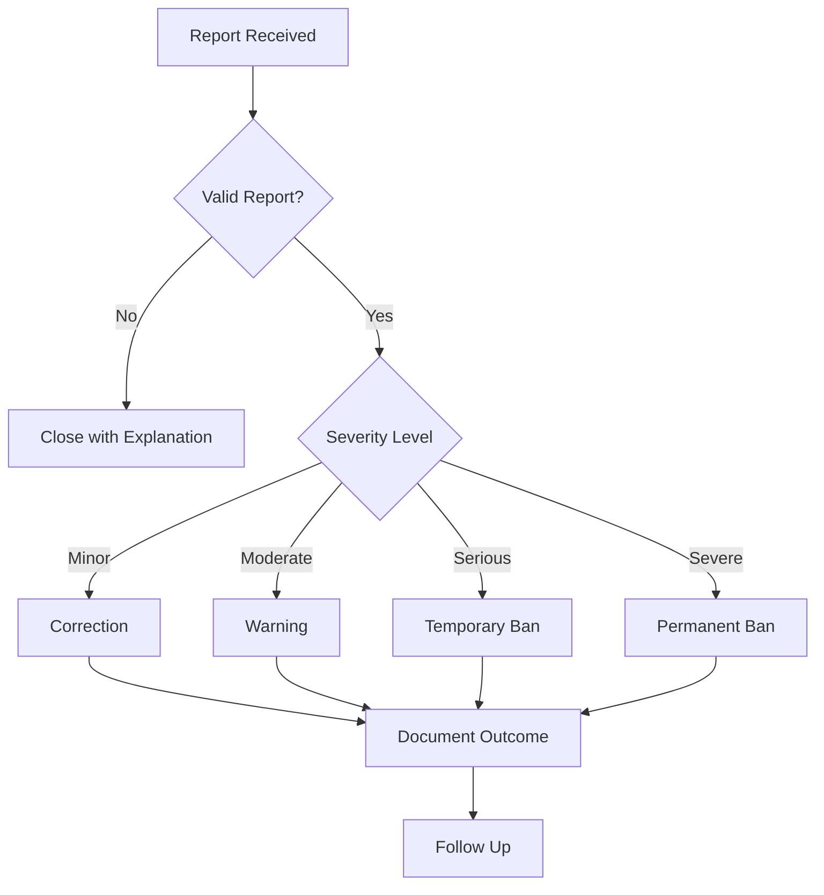

# 🤗 Contributor Covenant Code of Conduct

---

## 📜 Our Pledge

We as members, contributors, and leaders pledge to make participation in our
community a **harassment-free experience** for everyone, regardless of:

- Age
- Body size
- Visible or invisible disability
- Ethnicity
- Sex characteristics
- Gender identity and expression
- Level of experience
- Education
- Socio-economic status
- Nationality
- Personal appearance
- Race
- Religion
- Sexual identity and orientation

We pledge to act and interact in ways that contribute to an open, welcoming,
diverse, inclusive, and healthy community.

---

## 🌟 Our Standards

### Examples of Positive Behavior

| ✅ Do | Description |
|-------|-------------|
| 🤝 **Empathy** | Demonstrate empathy and kindness toward others |
| 👂 **Listen** | Listen actively to different viewpoints |
| 💬 **Feedback** | Give and gracefully accept constructive feedback |
| 📚 **Learn** | Accept responsibility and learn from mistakes |
| 🎯 **Community-first** | Focus on what's best for the community |

### Examples of Unacceptable Behavior

| ❌ Don't | Description |
|----------|-------------|
| 🚫 **Harassment** | Sexualized language, imagery, or unwelcome advances |
| 🚫 **Trolling** | Insulting, derogatory comments, personal attacks |
| 🚫 **Privacy** | Publishing others' private information |
| 🚫 **Professionalism** | Inappropriate conduct in professional settings |

---

## 🛡️ Enforcement Responsibilities

Community leaders are responsible for clarifying and enforcing our standards of
acceptable behavior and will take appropriate and fair corrective action in
response to any behavior that they deem inappropriate, threatening, offensive,
or harmful.

Community leaders have the right and responsibility to remove, edit, or reject
comments, commits, code, wiki edits, issues, and other contributions that are
not aligned to this Code of Conduct, and will communicate reasons for moderation
decisions when appropriate.

---

## 📍 Scope

This Code of Conduct applies within all community spaces, and also applies when
an individual is officially representing the community in public spaces.

Examples of representing our community:
- Using an official e-mail address
- Posting via an official social media account
- Acting as an appointed representative at an online or offline event

---

## 🚨 Enforcement

### Reporting

Instances of abusive, harassing, or otherwise unacceptable behavior may be
reported to the community leaders responsible for enforcement at:

**📧 conduct@sheshaaos.dev**

All complaints will be reviewed and investigated promptly and fairly.

All community leaders are obligated to respect the privacy and security of the
reporter of any incident.

---

## ⚖️ Enforcement Guidelines

Community leaders will follow these Community Impact Guidelines in determining
the consequences for any action they deem in violation of this Code of Conduct:

### 1. 📝 Correction

**Community Impact**: Use of inappropriate language or other behavior deemed
unprofessional or unwelcome.

**Consequence**: A private, written warning from community leaders, providing
clarity around the nature of the violation and an explanation of why the
behavior was inappropriate. A public apology may be requested.

### 2. ⚠️ Warning

**Community Impact**: A violation through a single incident or series of actions.

**Consequence**: A warning with consequences for continued behavior. No
interaction with the people involved, including unsolicited interaction with
those enforcing the Code of Conduct, for a specified period of time. This
includes avoiding interactions in community spaces as well as external channels
such as social media. Violating these terms may lead to a temporary or permanent
ban.

### 3. 🔇 Temporary Ban

**Community Impact**: A serious violation of community standards, including
sustained inappropriate behavior.

**Consequence**: A temporary ban from any sort of interaction or public
communication with the community for a specified period of time. No public or
private interaction with the people involved, including unsolicited interaction
with those enforcing the Code of Conduct, is allowed during this period.
Violating these terms may lead to a permanent ban.

### 4. 🚫 Permanent Ban

**Community Impact**: Demonstrating a pattern of violation of community
standards, including sustained inappropriate behavior, harassment of an
individual, or aggression toward or disparagement of classes of individuals.

**Consequence**: A permanent ban from any sort of public interaction within
the community.

---

## 📋 Decision Flowchart

---

## 🌍 Attribution

This Code of Conduct is adapted from the
[Contributor Covenant](https://www.contributor-covenant.org),
version 2.1,
available at
https://www.contributor-covenant.org/version/2/1/code_of_conduct.html.

Community Impact Guidelines were inspired by
[Mozilla's code of conduct enforcement ladder](https://github.com/mozilla/diversity).

For answers to common questions about this code of conduct, see the FAQ at
https://www.contributor-covenant.org/faq.

Translations are available at
https://www.contributor-covenant.org/translations.

---

  <b>🤗 We are committed to making SheshaAOS a welcoming community for everyone</b>

