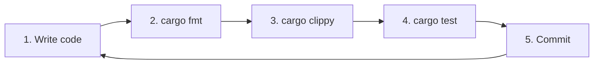
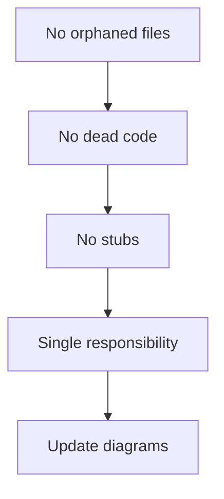
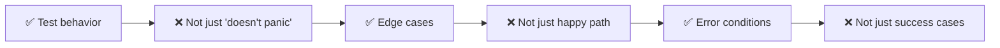
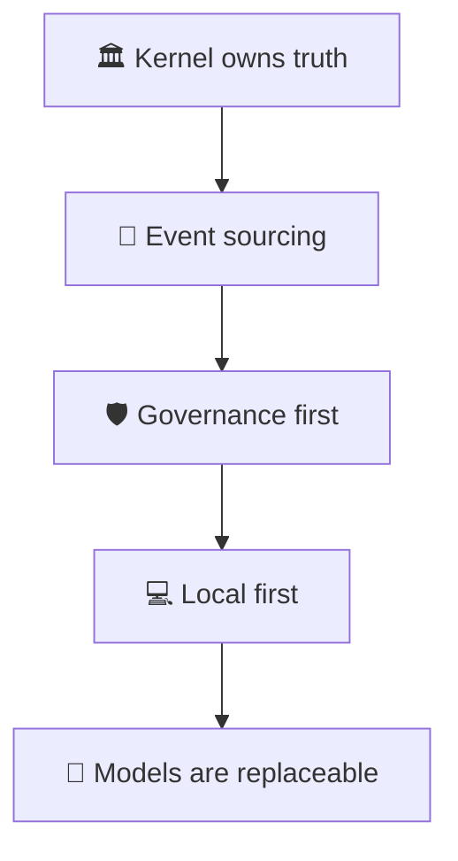
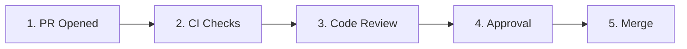

# 🤝 Contributing to SheshAOS


Thank you for your interest in contributing to **SheshAOS**! This document describes the development workflow, code standards, and review process.

---

## 📋 Table of Contents

- [Code of Conduct](#code-of-conduct)
- [Getting Started](#getting-started)
- [Development Workflow](#development-workflow)
- [Commit Convention](#commit-convention)
- [Branch Strategy](#branch-strategy)
- [Pull Request Rules](#pull-request-rules)
- [Code Standards](#code-standards)
- [Testing Requirements](#testing-requirements)
- [Architecture Rules](#architecture-rules)
- [Review Process](#review-process)
- [Merge Rules](#merge-rules)
- [FAQ](#faq)

---

## 🤗 Code of Conduct

Be respectful, constructive, and inclusive. We follow the [Contributor Covenant](https://www.contributor-covenant.org/).

Report violations to: **conduct@shesh.dev**

---

## 🚀 Getting Started

### 1. Fork & Clone

```bash
git clone https://github.com/YOUR_USERNAME/SheshAOS.git
cd SheshAOS
```

### 2. Install Dependencies

```bash
# Install Rust toolchain
rustup default stable
rustup component add clippy rustfmt

# Build the project
cargo build --workspace

# Verify tests pass
cargo test --workspace
```

### 3. Create a Branch

```bash
git checkout -b feat/your-feature-name
# or
git checkout -b fix/issue-number-description
```

---

## 🔄 Development Workflow

### Daily Development Loop



### Required Checks Before PR

| Check | Command | Required |
|-------|---------|----------|
| 🎨 Formatting | `cargo fmt --check` | ✅ Yes |
| 🔍 Linting | `cargo clippy --all-targets -- -D warnings` | ✅ Yes |
| 🧪 Tests | `cargo test --workspace` | ✅ Yes |
| 🔒 Security | No `unwrap()`/`expect()` in production | ✅ Yes |
| 📊 Coverage | All new public functions tested | ✅ Yes |
| 📐 Architecture | Update diagrams if adding modules | ✅ Yes |

### Helper Scripts

```bash
# Full verification
./scripts/dev.sh all

# Individual commands
make check    # cargo check
make test     # cargo test
make lint     # fmt + clippy
make fmt      # cargo fmt
make build    # cargo build
make bench    # cargo bench
```

---

## 📝 Commit Convention

We use [Conventional Commits](https://www.conventionalcommits.org/):

```
type(scope): description
```

### Commit Types

| Type | 🎯 Purpose | 🏷️ Example |
|------|-----------|-----------|
| `feat` | ✨ New feature | `feat(kernel): add task deduplication` |
| `fix` | 🐛 Bug fix | `fix(waveobj): correct LayoutState otype` |
| `docs` | 📚 Documentation | `docs(architecture): add rendering diagram` |
| `refactor` | ♻️ Code change | `refactor(gui): collapse if-let chains` |
| `test` | 🧪 Tests | `test(wps): add scope matching tests` |
| `chore` | 🔧 Maintenance | `chore: update dependencies` |
| `ci` | 🚀 CI/CD | `ci: add benchmark workflow` |
| `perf` | ⚡ Performance | `perf(terminal): optimize VT100 parsing` |
| `style` | 🎨 Formatting | `style: run cargo fmt` |

### Examples

```
feat(kernel): add task deduplication based on dedup_window_secs
fix(waveobj): correct LayoutState otype from layoutstate to layout
docs(architecture): add terminal rendering pipeline diagram
test(wps): add scope matching edge case tests
refactor(gui): collapse nested if-let chains with && let
perf(terminal): implement zero-allocation ANSI parsing
```

---

## 🌿 Branch Strategy

```
main ──────────────────────────────────────► Production
  │
  ├─ feat/feature-name ────────────────────► New features
  ├─ fix/issue-number ─────────────────────► Bug fixes
  ├─ docs/section-name ────────────────────► Documentation
  ├─ refactor/module-name ─────────────────► Refactoring
  ├─ test/module-name ─────────────────────► Test improvements
  └─ ci/workflow-name ─────────────────────► CI/CD changes
```

### Branch Naming Convention

| Pattern | Usage |
|---------|-------|
| `feat/descriptive-name` | New features |
| `fix/issue-number-description` | Bug fixes |
| `docs/section-name` | Documentation |
| `refactor/module-name` | Refactoring |
| `test/module-name` | Test improvements |
| `ci/workflow-name` | CI/CD changes |

---

## 🔀 Pull Request Rules

### 1. One Concern Per PR

```
❌ Bad: feat(kernel): add dedup + fix CLI bug + update docs
✅ Good: feat(kernel): add task deduplication
```

### 2. PR Title Convention

Must follow conventional commits. Enforced by CI.

```
✅ feat(kernel): add task deduplication
✅ fix(waveobj): correct LayoutState otype
❌ "fixed stuff" or "updates"
```

### 3. PR Size Limits

| Size | Lines | Action |
|------|-------|--------|
| Small | < 200 | ✅ Preferred |
| Medium | 200-500 | ⚠️ Acceptable |
| Large | > 500 | ❌ Split into multiple PRs |

### 4. Draft PRs

- Draft PRs are allowed for early feedback
- Must be marked **Ready for Review** before merge
- CI runs on draft PRs but merge is blocked

### 5. Merge Strategy

| Strategy | Allowed | Notes |
|----------|---------|-------|
| Squash merge | ✅ Preferred | Clean linear history |
| Rebase merge | ✅ Allowed | For small PRs |
| Merge commit | ❌ Disallowed | Pollutes history |

---

## 📋 PR Template

```markdown
## What does this PR do?

Brief description of the change.

## Type of change

- [ ] 🐛 Bug fix
- [ ] ✨ New feature
- [ ] 💥 Breaking change
- [ ] 📚 Documentation update
- [ ] ♻️ Refactoring
- [ ] 🧪 Test improvement
- [ ] 🚀 CI/CD change

## Checklist

- [ ] `cargo fmt --check` passes
- [ ] `cargo clippy --all-targets -- -D warnings` passes
- [ ] `cargo test --workspace` passes
- [ ] Added tests for new public functions
- [ ] Updated `.kilo/plans/architecture.md` if adding modules
- [ ] No `unwrap()` or `expect()` in production code
- [ ] No orphaned files added
- [ ] PR title follows conventional commits

## Related issues

Closes #123

## Additional notes

Any additional context or screenshots.
```

---

## 📏 Code Standards

### Rust Standards

| Rule | Requirement | Rationale |
|------|-------------|-----------|
| Edition | 2021+ | Modern Rust features |
| Formatting | `cargo fmt` | Consistent style |
| Clippy | `-D warnings` | Zero warnings policy |
| `unwrap()` | ❌ Production code | Use `unwrap_or_else(|e| e.into_inner())` |
| `expect()` | ❌ Production code | Use proper error handling |
| Error handling | `?` operator | Prefer over manual match |
| Async traits | `async_trait` | Required for async in traits |
| Documentation | All public items | Doc comments required |

### Architecture Standards



| Rule | Description |
|------|-------------|
| **No orphaned files** | Every `.rs` must be in a `Cargo.toml` crate |
| **No dead code** | Remove unused functions/imports/modules |
| **No stubs** | Implement fully or use `todo!()` with issue link |
| **Single responsibility** | One concern per module |
| **Update diagrams** | Update architecture.md when adding/removing modules |

### Naming Conventions

| Item | Convention | Example |
|------|------------|---------|
| Crate names | `snake_case` | `shesh_kernel` |
| Module names | `snake_case` | `event_store` |
| Function names | `snake_case` | `submit_task` |
| Struct names | `PascalCase` | `TaskProjection` |
| Trait names | `PascalCase` | `ModelProvider` |
| Constants | `SCREAMING_SNAKE_CASE` | `MAX_RETRIES` |

---

## 🧪 Testing Requirements

### Test Organization

```
crate/
├── src/
│   ├── lib.rs          # Unit tests in #[cfg(test)] mod tests
│   ├── module.rs       # Unit tests in #[cfg(test)] mod tests
│   └── ...
├── tests/
│   ├── integration/    # Integration tests
│   ├── benchmarks/     # Criterion benchmarks
│   └── ...
```

### Coverage Requirements

| Type | Requirement | Location |
|------|-------------|----------|
| **Unit tests** | Every public function | `#[cfg(test)]` in source files |
| **Integration tests** | Critical workflows | `tests/integration/` |
| **Benchmarks** | Performance-critical paths | `tests/benchmarks/` |
| **Doc tests** | All examples in docs | Inline in doc comments |

### Test Quality Standards



| Good Test | Bad Test |
|-----------|----------|
| Verifies return values | Just checks it doesn't panic |
| Tests edge cases | Only tests happy path |
| Tests error conditions | Only tests success cases |
| Uses discriminative assertions | Uses `assert!(true)` |

---

## 🏗️ Architecture Rules

### Core Principles



1. **Kernel owns truth** — Models propose actions; the kernel validates, constrains, and records
2. **Event sourcing** — Every state change is an append-only event
3. **Governance first** — All actions pass through policy checks
4. **Local first** — Core operations work offline
5. **Models are replaceable** — Kernel speaks to provider interface

### Dependency Rules

```
✅ Allowed:
shesh-kernel → shesh-waveobj
shesh-tui → shesh-kernel
shesh-gui → shesh-ai

❌ Forbidden:
shesh-waveobj → shesh-kernel (circular)
shesh-tui → shesh-ai (bypasses kernel)
```

### Module Responsibilities

| Crate | Responsibility |
|-------|----------------|
| `shesh-kernel` | Governance, routing, policy, event sourcing |
| `shesh-waveobj` | Object persistence, ORef graph, metadata |
| `shesh-wps` | Pub/sub events, scoping, history |
| `shesh-blockctl` | PTY lifecycle, shell I/O |
| `shesh-terminal` | Zig VT100 parser, PTY bridge |
| `shesh-ai` | OpenAI/Anthropic streaming, sessions |
| `shesh-remote` | SSH client, connection management |
| `shesh-rpc` | Unix socket JSON-RPC |
| `shesh-gui` | Iced native GUI |
| `shesh-tui` | Ratatui TUI |
| `shesh-vault` | Command snippets, flag inspector |
| `shesh-wconfig` | Config watcher, settings |

---

## 🔍 Review Process

### Review Flow



### Review Stages

| Stage | Who | What |
|-------|-----|------|
| 1. Automated | CI | Lint, test, build, security |
| 2. Code review | Maintainer | Logic, style, architecture |
| 3. Architecture review | Architect | Core module changes |
| 4. Security review | Security team | Policy, auth, tools |
| 5. Merge | Maintainer | Final approval + squash |

### Review Checklist

- [ ] CI checks pass
- [ ] Code follows style guidelines
- [ ] Tests added for new functionality
- [ ] Documentation updated
- [ ] Architecture diagrams updated if needed
- [ ] No security vulnerabilities introduced
- [ ] Performance impact considered

---

## 🔀 Merge Rules

### Requirements

| Requirement | Description |
|-------------|-------------|
| ✅ CI checks | All checks must pass |
| ✅ Approval | At least 1 from code owner |
| ✅ No conflicts | Branch up to date with base |
| ✅ Resolved reviews | All review threads closed |
| ✅ Size limit | Under 500 lines preferred |

### Merge Process

1. **Squash and merge** — Clean linear history
2. **Delete branch** — After successful merge
3. **Tag release** — For significant changes
4. **Update changelog** — Document the change

---

## 🛡️ Security Policy

See [SECURITY.md](SECURITY.md) for vulnerability reporting.

### Key Points

- **Never commit secrets** — Use environment variables
- **Policy code review** — All auth/policy changes require 2 approvals
- **Dependency audit** — Run `cargo audit` regularly
- **SSH keys** — `check_server_key` must be configured for production

---

## ❓ FAQ

### How do I report a bug?

Open an issue using the [Bug Report](.github/ISSUE_TEMPLATE/bug_report.md) template.

### How do I request a feature?

Open an issue using the [Feature Request](.github/ISSUE_TEMPLATE/feature_request.md) template.

### Who approves my PR?

See [CODEOWNERS](.github/CODEOWNERS) for module ownership.

### How long does review take?

- **Small PRs (< 200 lines)**: 1-2 days
- **Medium PRs (200-500 lines)**: 3-5 days
- **Large PRs (> 500 lines)**: Split into smaller PRs

### Can I work on an issue?

Comment `"/assign"` on the issue to claim it.

---

## 📞 Contact

- **Issues**: [GitHub Issues](https://github.com/shesh/SheshAOS/issues)
- **Discussions**: [GitHub Discussions](https://github.com/shesh/SheshAOS/discussions)
- **Email**: team@shesh.dev
- **Conduct**: conduct@shesh.dev

---

<p align="center">
  <b>Built with ❤️ by the SheshAOS Team</b>
</p>

<p align="center">
  <a href="https://github.com/shesh/SheshAOS">GitHub</a> •
  <a href="https://github.com/shesh/SheshAOS/issues">Issues</a> •
  <a href="https://github.com/shesh/SheshAOS/discussions">Discussions</a>
</p>
