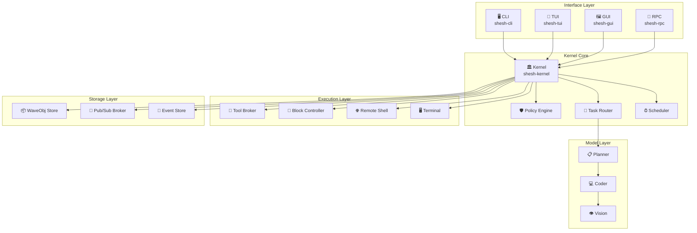
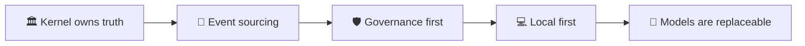
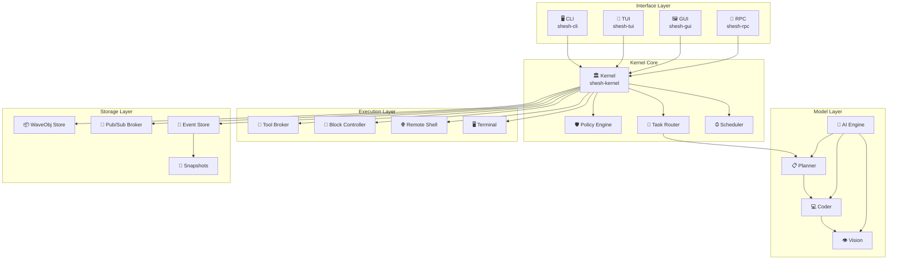
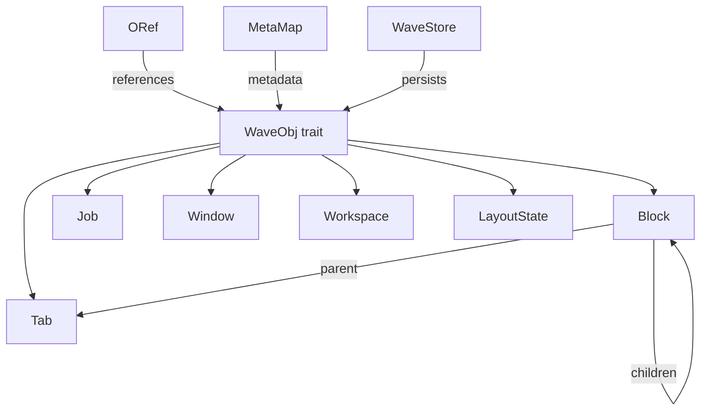

## 🦀 SheshAOS


**🏛️ Governance-first, event-sourced AI operating environment
for Ubuntu Linux.**

[📖 Docs](.kilo/plans/architecture.md)  
[🤝 Contributing](CONTRIBUTING.md)  
[🔒 Security](SECURITY.md)  
[📝 Changelog](CHANGELOG.md)  
[💬 Discussions](https://github.com/shesh/SheshAOS/discussions)

---

## 📋 About

**SheshAOS** is a production-ready, open-source AI operating
environment that combines local LLM inference, terminal
emulation, SSH multiplexing, and governance-first task
execution into a unified Rust system.

### 🎯 Mission

To provide a **governance-first AI platform** where:

- Models propose actions; the kernel validates and records
- Every state change is append-only and auditable
- Destructive operations require explicit policy approval
- Core operations work offline without cloud dependencies
- AI providers are replaceable via a common interface

### 📊 Project Stats

| Metric | Value |
| ------- | ----- |
| 🦀 **Language** | Rust 2024 |
| 📦 **Crates** | 12 workspace crates |
| 🧪 **Tests** | 981 passing |
| 🔍 **Lints** | 0 warnings |
| 🚀 **CI/CD** | GitHub Actions |
| 📄 **License** | MIT |
| 🏷️ **Status** | Production Ready |

### 🌟 What Makes SheshAOS Different

| Traditional AI Tools | SheshAOS |
| ------------------- | -------- |
| Cloud-dependent | 💻 **Local-first** — works offline |
| No oversight | 🛡️ **Governance-first** — kernel validates everything |
| Mutable state | 📝 **Event-sourced** — append-only audit trail |
| Single model lock-in | 🔌 **Provider interface** — replaceable models |
| No terminal integration | 🖥️ **Native terminal** — PTY + VT100 + SSH |

### 🏗️ System Architecture



### 🚀 Quick Start

```bash
# Clone
git clone https://github.com/shesh/SheshAOS.git
cd SheshAOS

# Build
cargo build --release

# Initialize
./target/release/shesh init

# Run
./target/release/shesh run "describe the project structure"
```

### 🧪 Quality Metrics

| Check | Status |
| ----- | ------ |
| ✅ Compilation | 0 errors, 0 warnings |
| ✅ Lints | 0 clippy warnings |
| ✅ Tests | 981 passing |
| ✅ Benchmarks | 6 criterion benches |
| ✅ CI/CD | Full pipeline configured |
| ✅ Security | Policy + audit + scanning |

### 📚 Documentation

| Document | Purpose |
| --------- | -------- |
| [📖 Architecture](.kilo/plans/architecture.md) | System diagrams and data flows |
| [🤝 Contributing](CONTRIBUTING.md) | Development workflow |
| [🔒 Security](SECURITY.md) | Vulnerability reporting |
| [📝 Changelog](CHANGELOG.md) | Version history |
| [📋 Handover](HANDOVER.md) | Developer transition guide |
| [🤗 Code of Conduct](CODE_OF_CONDUCT.md) | Community standards |

### 🌐 Topics

`rust` `terminal` `ai` `governance` `event-sourcing` `microkernel` `tui` `gui` `ssh`
`pty` `sqlite` `iced` `ratatui` `local-first` `privacy` `open-source`

---

## 🎯 Overview

SheshAOS is a **microkernel-like system** that routes tasks to
specialist local AI models (planner, coder, vision), enforces
policy on every action, and keeps an **append-only audit trail**
of every state change.

### Why SheshAOS?

| Problem | Solution |
| -------- | -------- |
| 🤖 AI lacks oversight | ✅ **Governance-first**: Kernel validates actions |
| 📝 State is mutable | ✅ **Event sourcing**: Append-only log |
| 🔌 Cloud-dependent AI tools | ✅ **Local-first**: Works offline, no cloud |
| 🔒 Destructive ops need approval | ✅ **Policy engine**: Actions pass checks |
| 🧩 Locked to one model | ✅ **Provider interface**: Models are swappable |

### Design Principles



---

## ✨ Key Features

### 🧠 AI Chat Engine

- **Streaming responses** from OpenAI-compatible and Anthropic endpoints
- **Real-time token streaming** directly into TUI/GUI
- **Multi-modal support** with vision capabilities
- **Session management** with full conversation history

### 🖥️ Terminal Emulation

- **Native PTY management** with backpressure-aware reading
- **Zig VT100 parser** for zero-allocation ANSI parsing
- **Split-pane layouts** with dynamic tile management
- **AI-assisted terminal** with inline code suggestions

### 🔐 Security & Governance

- **Policy engine** with trust tiers and capability-based security
- **Approval modals** for destructive operations
- **Append-only event store** with cryptographic integrity
- **SSH multiplexing** with connection monitoring

### 🌐 Remote Management

- **Native SSH client** via `russh`
- **Connection health monitoring**
- **Remote PTY shell tunneling**
- **Config watcher** with live reload

### 🎨 User Interfaces

- **TUI**: Ratatui-based terminal interface
- **GUI**: Iced-based native desktop GUI
- **CLI**: Full-featured command-line interface
- **IPC**: JSON-RPC 2.0 over Unix sockets

---

## 🏗️ Architecture

### High-Level Architecture



### Runtime Data Flow


### Wave Object Model



---

## 🛠️ Tech Stack

### Core Technologies

| Category | Technology | Purpose |
| -------- | ---------- | ------- |
| **Language** | Rust 2024 | Core implementation |
| **Async Runtime** | Tokio | Async execution |
| **Serialization** | Serde / JSON | Data interchange |
| **Terminal** | Ratatui + Crossterm | TUI rendering |
| **GUI** | Iced 0.14 | Native desktop GUI |
| **PTY** | portable-pty | Shell process management |
| **ANSI Parser** | vte + Zig VT100 | Terminal escape parsing |
| **AI/ML** | reqwest + SSE | Streaming providers |
| **SSH** | russh | Remote connections |
| **Persistence** | SQLite (rusqlite) | Object storage |
| **Policy** | Custom engine | Governance |
| **Observability** | tracing | Logging/metrics |

### External Integrations

| Integration | Type | Purpose |
| ---------- | ---- | ------- |
| OpenAI-compatible APIs | HTTP/SSE | LLM streaming |
| Anthropic API | HTTP/SSE | Claude models |
| SSH servers | Network | Remote execution |
| Unix sockets | IPC | External control |
| File watcher | OS | Config hot-reload |

---

## 🖥️ Hardware Target

| Component | Specification |
| ---------- | ------------- |
| **CPU** | Intel i7-14700HX |
| **GPU** | NVIDIA RTX 4050 (6 GB VRAM) |
| **Memory** | 16 GB RAM |
| **OS** | Ubuntu 26.04 LTS |
| **Storage** | NVMe SSD recommended |

---

## 🤖 Model Stack

| Role | Model | Quantization | Use Case |
| ----- | ------ | ------------ | -------- |
| 📋 **Planner** | Gemma 4 12B | Q4_K_M | Architecture, planning, review |
| 💻 **Coder** | Qwen3-Coder 30B | Q4_K_M | Implementation, debugging, tests |
| 👁️ **Vision** | Qwen3.5 9B | Q4_K_M | Screenshots, diagrams, documents |

---

## 🚀 Quick Start Guide

### Prerequisites

- Rust 1.75+ (edition 2024)
- Ubuntu 22.04+ (or compatible Linux)
- 16 GB RAM minimum
- NVIDIA GPU recommended for GUI

### Installation

```bash
# Clone the repository
git clone https://github.com/shesh/SheshAOS.git
cd SheshAOS

# Build the project
cargo build --release

# Run initialization
./target/release/shesh init

# Check system health
./target/release/shesh doctor

# Start interactive TUI
./target/release/shesh tui

# Run a task
./target/release/shesh run "describe the project structure"
```

### Development Setup

```bash
# Install dependencies
cargo build

# Run all tests
cargo test --workspace

# Run lints
cargo clippy --all-targets -- -D warnings

# Format code
cargo fmt

# Run benchmarks
cargo bench --workspace
```

---

## 📁 Project Structure

```text
SheshAOS/
├── .github/                    # GitHub Actions, templates, dependabot
│   ├── workflows/             # CI/CD pipelines
│   ├── ISSUE_TEMPLATE/        # Issue templates
│   ├── PULL_REQUEST_TEMPLATE.md
│   ├── CODEOWNERS
│   └── BRANCH_PROTECTION.md
├── bin/shesh-cli/          # CLI binary entrypoint
├── crates/
│   ├── shesh-kernel/       # 🏛️ Core governance microkernel
│   ├── shesh-waveobj/      # 📦 Object store & ORef graph
│   ├── shesh-wps/          # 📡 Pub/Sub event broker
│   ├── shesh-blockctl/     # 🧱 PTY shell controller
│   ├── shesh-terminal/     # 🖥️ Zig VT100 + PTY bridge
│   ├── shesh-ai/           # 🤖 OpenAI/Anthropic streaming
│   ├── shesh-remote/       # 🌐 SSH remote shell
│   ├── shesh-rpc/          # 🔌 Unix socket JSON-RPC
│   ├── shesh-gui/          # 🖼️ Iced native GUI
│   ├── shesh-tui/          # 📱 Ratatui TUI
│   ├── shesh-vault/        # 🔐 Command snippets & inspector
│   └── shesh-wconfig/      # ⚙️ Config watcher & settings
├── tests/                     # Integration tests & benchmarks
├── configs/                   # Configuration files
├── scripts/                   # Dev/test helper scripts
├── docs/                      # Additional documentation
├── .kilo/plans/architecture.md # 🏗️ System architecture diagrams
├── Cargo.toml                 # Workspace definition
├── Makefile                   # Build shortcuts
├── .clippy.toml               # Lint configuration
├── rustfmt.toml               # Format configuration
├── CONTRIBUTING.md            # Contribution guidelines
├── CODE_OF_CONDUCT.md         # Community standards
├── SECURITY.md                # Security policy
├── CHANGELOG.md               # Version history
└── README.md                  # This file
```

---

## 🧪 Testing

### Test Coverage

| Crate | Tests |
| ----- | ----- |
| shesh-kernel | 396 |
| shesh-waveobj | 204 |
| shesh-wps | 71 |
| shesh-blockctl | 48 |
| shesh-ai | 18 |
| shesh-rpc | 29 |
| shesh-remote | 19 |
| shesh-terminal | 19 |
| shesh-vault | 53 |
| shesh-wconfig | 31 |
| shesh-gui | 32 |
| shesh-tui | 30 |
| **Total** | **981** |

### Running Tests

```bash
# Unit tests
cargo test --lib --workspace

# Integration tests
cargo test --workspace --tests

# Doc tests
cargo test --workspace --doc

# All tests
cargo test --workspace

# With coverage
cargo test --workspace -- --nocapture
```

### Benchmarking

```bash
# Run all benchmarks
cargo bench --workspace

# Specific benchmark
cargo bench -p shesh-kernel bench_kernel_task_submission
```

| Benchmark | Description |
| --------- | ----------- |
| `bench_terminal_parsing` | VT100 parser throughput |
| `bench_kernel_task_submission` | Task submission latency |
| `bench_event_store` | Event append/read throughput |
| `bench_terminal_rendering` | Span-batching render simulation |
| `bench_snapshot_projection` | Replay engine performance |
| `bench_tool_broker_throughput` | Tool broker routing |

---

## 📚 Docs

- **📖 Architecture**: `.kilo/plans/architecture.md` — Complete system diagrams
- **🤝 Contributing**: `CONTRIBUTING.md` — Development workflow
- **🔒 Security**: `SECURITY.md` — Vulnerability reporting
- **📝 Changelog**: `CHANGELOG.md` — Version history
- **📋 Handover**: `HANDOVER.md` — Developer transition guide

---

## 🤝 Contributing

We welcome contributions! Please see [CONTRIBUTING.md](CONTRIBUTING.md)
for detailed guidelines.

### Quick Contribution Checklist

- [ ] `cargo fmt --check` passes
- [ ] `cargo clippy --all-targets -- -D warnings` passes
- [ ] `cargo test --workspace` passes
- [ ] No `unwrap()` or `expect()` in production code
- [ ] All new public functions have tests
- [ ] PR title follows conventional commits

### Code of Conduct

This project adheres to a [Code of Conduct](CODE_OF_CONDUCT.md).
By participating, you agree to uphold a welcoming and inclusive
environment.

### License

This project is licensed under the [MIT License](LICENSE).

---

## 🙏 Acknowledgments

- **Alacritty** — VTE parser integration patterns
- **WezTerm** — GPU-accelerated rendering architecture
- **Warp** — AI streaming UI patterns
- **Kitty** — PTY backpressure handling
- **Ghostty** — Modern terminal rendering
- **Tabby** — Remote shell architecture

---

### Built with ❤️ by the SheshAOS Team

[GitHub](https://github.com/shesh/SheshAOS) • [Issues](https://github.com/shesh/SheshAOS/issues)
• [Discussions](https://github.com/shesh/SheshAOS/discussions)
