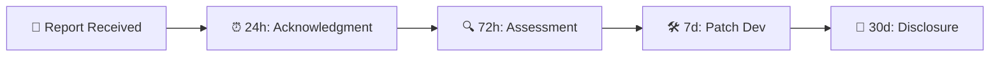
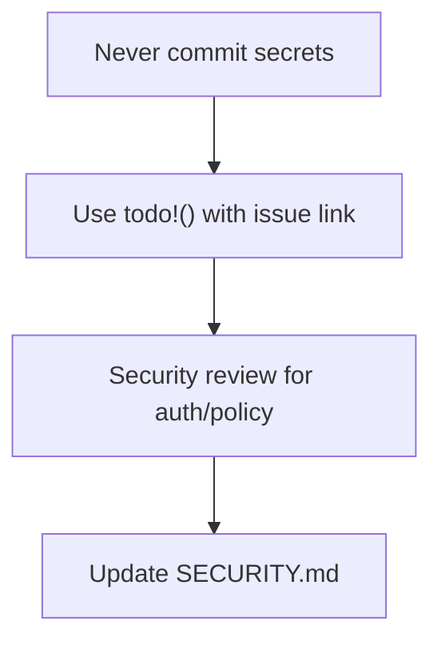
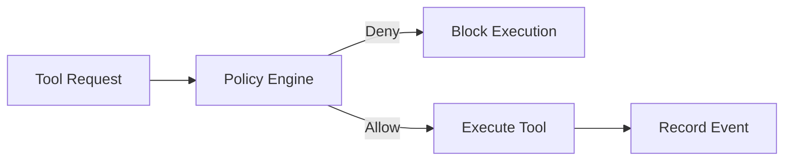
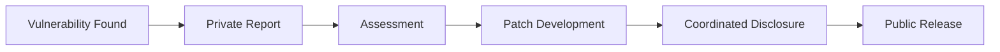

# 🛡️ Security Policy


## 📋 Supported Versions

| Version | Supported | Security Updates |
|---------|-----------|------------------|
| main (unreleased) | ✅ Active development | ✅ Yes |
| v0.1.x | ✅ Supported | ✅ Yes |
| < v0.1.0 | ❌ End of life | ❌ No |

---

## 🚨 Reporting a Vulnerability

If you discover a security vulnerability, **please report it privately**. Do not open a public issue.

### Reporting Channels

| Method | Contact | Purpose |
|--------|---------|---------|
| 📧 Email | security@sheshaaos.dev | Primary reporting channel |
| 🐛 GitHub | Private security advisory | Alternative reporting |

### Report Content

Please include:

1. **Affected version/commit** — Exact version or commit hash
2. **Steps to reproduce** — Detailed reproduction steps
3. **Potential impact** — What could an attacker do?
4. **Suggested fix** — If you have one
5. **Your info** — For credit/anonymity preferences

### Example Report

```
Subject: [SECURITY] Buffer overflow in VT100 parser

Affected: v0.1.0, commit abc1234
Impact: Remote code execution via crafted terminal input
Steps:
  1. Connect to NexusaOS via SSH
  2. Send crafted ANSI sequence
  3. Observe memory corruption
Suggested fix: Validate input length before parsing
```

---

## ⏱️ Response Timeline



| Phase | Timeline | Action |
|-------|----------|--------|
| 📧 Acknowledgment | 24 hours | Confirm receipt, assign CVE |
| 🔍 Assessment | 72 hours | Classify severity, assign team |
| 🛠️ Development | 7 days | Begin patch development |
| 📢 Disclosure | 30 days | Coordinated public disclosure |

---

## 🎯 Severity Levels

| Level | Description | Response Time | SLA |
|-------|-------------|---------------|-----|
| 🔴 **Critical** | RCE, data exfiltration | 24 hours | Immediate |
| 🟠 **High** | Privilege escalation, policy bypass | 72 hours | 3 days |
| 🟡 **Medium** | Information disclosure, DoS | 7 days | 1 week |
| 🟢 **Low** | Best practice violations | 30 days | 1 month |

### Severity Classification Guide

```
Critical (🔴):
- Remote code execution
- Unauthenticated access to kernel
- Event store tampering
- Policy bypass

High (🟠):
- Privilege escalation
- SSH key acceptance without validation
- AI prompt injection
- Unauthorized tool execution

Medium (🟡):
- Information disclosure
- Denial of service
- Configuration file exposure

Low (🟢):
- Missing documentation
- Non-critical warnings
- Style violations
```

---

## 🔐 Security Best Practices

### For Contributors



| Rule | Description |
|------|-------------|
| 🔑 No secrets | Never commit keys, tokens, or credentials |
| 📝 Todo with links | Use `todo!("issue #123")` for incomplete security code |
| 🔍 Review required | All auth/policy code needs security review |
| 📄 Update docs | Update SECURITY.md for new security features |
| 🧪 Test security | Add tests for security-critical paths |

### For Maintainers

| Rule | Description |
|------|-------------|
| 👀 Double review | Require 2 approvals for security-sensitive changes |
| 🔄 Rotate secrets | Regularly rotate API keys and credentials |
| 📦 Audit deps | Run `cargo audit` weekly |
| 📊 Monitor | Watch for suspicious activity |
| 🚨 Incident response | Have a response plan ready |

---

## ⚠️ Known Security Considerations

### 1. Tool Execution



All tool executions go through `PolicyEngine` before execution. Event is recorded regardless of outcome.

### 2. SSH Connections

> ⚠️ **Warning**: `ClientHandler::check_server_key` currently accepts all keys.

**Status**: Must be configured before production use. Configure known_hosts or implement proper key validation.

### 3. AI Providers

> ⚠️ **Warning**: API keys stored in config files.

**Mitigation**:
- Use file permissions `0600` for config files
- Consider using environment variables or secret managers
- Rotate keys regularly

### 4. Event Store

> ✅ **Secure**: Append-only design prevents tampering.

**Considerations**:
- Ensure proper filesystem permissions
- Regular backups
- Monitor disk space

---

## 📢 Disclosure Policy

### Process



### Guidelines

| Aspect | Policy |
|--------|--------|
| **Timing** | Disclose after patch is available |
| **Credit** | Given to reporters unless anonymity requested |
| **CVE** | Filed for significant vulnerabilities |
| **Communication** | Regular updates to reporter |

### Coordinated Disclosure Timeline

1. **Day 0**: Vulnerability reported
2. **Day 1**: Acknowledgment sent
3. **Day 3**: Severity classified, team assigned
4. **Day 10**: Patch developed and tested
5. **Day 30**: Patch released, public disclosure

---

## 📞 Contact

- **Security Team**: security@sheshaaos.dev
- **General Contact**: team@sheshaaos.dev
- **Conduct Issues**: conduct@sheshaaos.dev

---

<p align="center">
  <b>🔒 Security is everyone's responsibility</b>
</p>
