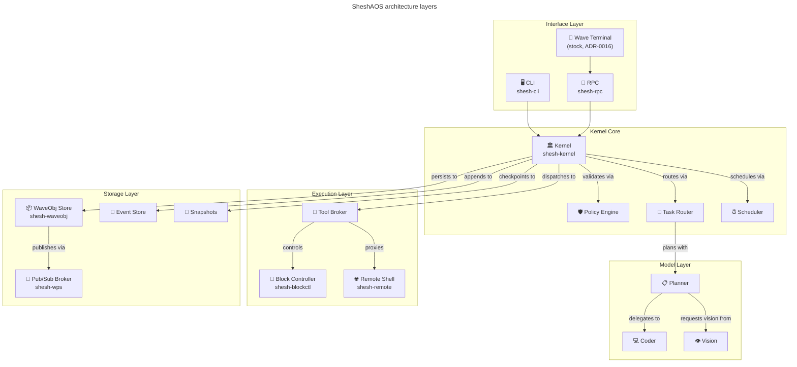
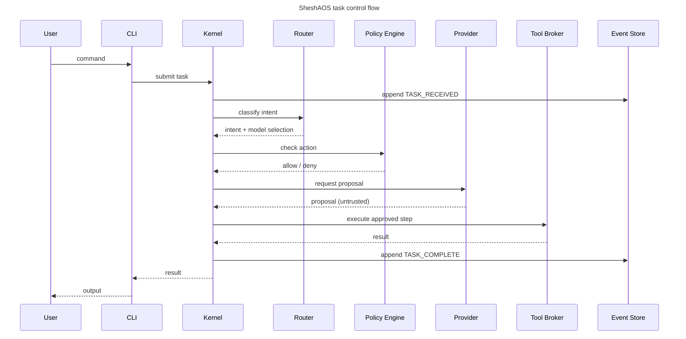

# SheshAOS — Architecture

See the architecture overview in the project root `README.md` and the full handover brief in `HANDOVER.md`.

## Layers



### Quick Reference

1. **Kernel** — Task intake, governance, scheduling, state transitions, audit
2. **Router** — Intent classification, model selection
3. **Policy Engine** — Deny-by-default action gating
4. **Model Providers** — Swappable specialist inference (planner, coder, vision)
5. **Tool Broker** — Filesystem, Git, Terminal with capability checks
6. **Event Store** — Append-only JSONL event log
7. **CLI** — Terminal interface for all kernel operations

## Control Flow



```text
User → CLI → Kernel → Router (classify) → Policy (check) → Provider (infer)
                ↓                                               ↓
          Event Store ← ← ← ← ← ← ← ← ← ← ← ← ← ← ← Tool Broker (execute)
```

## Trust Boundaries

- User input: **untrusted**
- Model output: **untrusted** (proposals only)
- Tool results: **partially trusted** (logged and validated)
- Event store: **trusted** (append-only, checksummed)

## Key Design Rules

- Models propose, never execute
- Tools execute, never decide
- Kernel validates everything
- Every state change is an event
- Every event is durable
